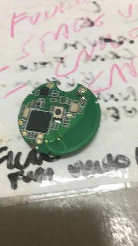
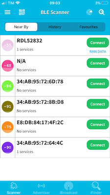
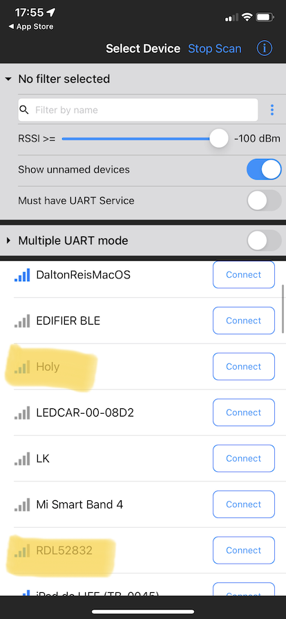

# Unidade 3

Local para postar a atividade da unidade 3.  

## Roteiro de apresentação

### Teórica

Apresentação deve constar:

- [ ] assunto para desenvolver o Projeto da disciplina  
- [ ] lista das funcionalidades  
- [ ] protótipo de telas (no caso pode ser desenhos de "todos" os espaços da aplicação)  
Nesta apresentação se pode utilizar slides, videos, ou mesmo de aplicações que sejam correlatas a ideia proposta para poder exemplificar o Projeto proposto.

### Prática

- [ ] Aplicação de exemplo usando template padrão disponível no Unity Hub: AR Core (AR Foundation)  
  - [ ] Podem pedir ajuda para a Equipe 2 de RA de como usar o VR Core  
- [ ] Exemplo de aplicações usando o AR no Unity: [UNITY MARS](https://unity.com/products/unity-mars?utm_source=google&utm_medium=cpc&utm_campaign=cc_dd_upr_amer_amer-t2_en_pu_sem-gg_acq_br-pr_2023-01_brand-at2_cc3022_ev-br_id:71700000105927803&utm_content=cc_dd_upr_amer_pu_sem_gg_ev-br_pros_x_npd_cpc_kw_sd_all_x_x_brand_id:58700008262791741&utm_term=unity&&&&&gad=1&gclid=Cj0KCQjwpPKiBhDvARIsACn-gzDSYdMpI7XAajrSRpYlkY6lVhbZs_d9eIY0hurQIra7xM8yYQU95ygaAkadEALw_wcB&gclsrc=aw.ds)  
- [ ] Comentar sobre o TCC que usou 
- [ ] Mostrar quais Assets vai usar para modelar o cenário do projeto  [TCC Beacon](#tcc-beacon)  
- [ ] Mostrar os Beacons fornecidos pelo prof. Miguel e aplicação de exemplo usando [Beacons Miguel](#beacons)  

## TCC Beacon

<https://www.furb.br/dsc/arquivos/tccs/monografias/2018_2_djonathan-rafael-krause_monografia.pdf>

## Beacons

  
  
  
